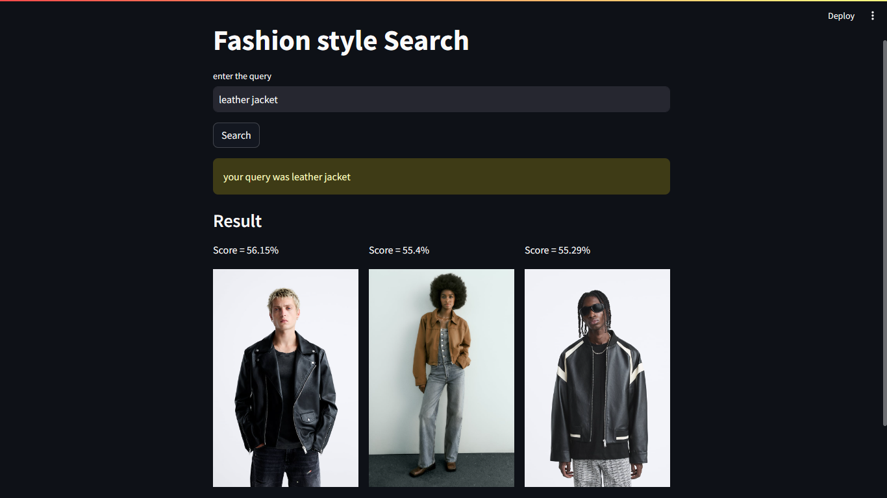

# Fashion Search

## Tech Stack Used

This project utilizes the Haystack library to create a fashion search engine capable of retrieving relevant images based on textual queries. It leverages multimodal retrievers to search for images using both text and image embeddings.**Haystack is alternative to Langchain**

Embedding Model is **clip-ViT-B-32**

- I have used MultiModalRetriever from haystack as a retriever node for performing multimodal search, which means searching using both text and image embeddings.

- It allows you to retrieve documents (in this case, images) based on both textual queries and visual similarity.

- This retriever is particularly useful for applications such as fashion search, where users may want to search for products using either text descriptions or similar images.
